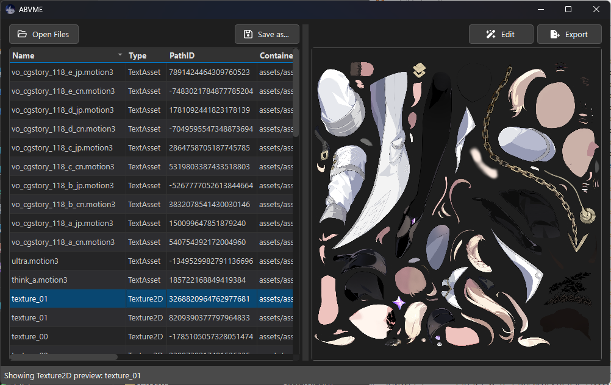

# ABVME
**Asset Bundles Viewer Modifier and Exporter**

A simple tool for viewing, modifying, and exporting Unity Asset Bundles.
Easy to use like [AssetStudio](https://github.com/Perfare/AssetStudio), but focused on making asset modification simpler. Built with Python using [UnityPy](https://github.com/K0lb3/UnityPy).

<details>
  <summary>Screenshot</summary>
  
</details>

## Usage
- You can use the pre-built executables from [Releases](https://github.com/com55/ABVME/releases/latest).
- Or, clone the repository and run from source:
  ```bash
  git clone https://github.com/com55/ABVME.git
  cd ABVME
  ```
  - **Using [uv](https://github.com/astral-sh/uv#installation) (Recommended)**
    ```bash
    uv sync
    uv run app.py
    ```
  - **Using pip**
    ```bash
    pip install -r requirements.txt
    python app.py
    ```

## Features
- **Asset Preview** - View asset contents directly
- **Asset Export** - Export single or multiple assets
- **Asset Modification** - Replace asset data
- **Drag & Drop Support** - Load AssetBundles by dropping files into table, modify assets by dropping replacement files onto preview area
- **Bundle Saving** - Save modified AssetBundles
- **Supported asset types**:
  - **TextAsset** - View, export, modify
  - **Texture2D** - View, export, replace

## TODO
- [ ] Mesh support
- [ ] CRC Corrector - Make CRC32 the same as the original file after modification
- [ ] Bundles Migration - Transfer modifications to new base files
- [ ] Atlas Image Unpacker
- [ ] [SpineSkeletonDataConverter](https://github.com/wang606/SpineSkeletonDataConverter) integration (add-on)
- [ ] [SpineViewer](https://github.com/ww-rm/SpineViewer) to render preview file integration (add-on)
- [ ] [BA-AD](https://github.com/Deathemonic/BA-AD) integration to find and download files when migrating to other platforms where they were not downloaded (add-on)

## Contributing
- Found a bug or have a suggestion? Please [open an issue](https://github.com/com55/ABVME/issues)
- Pull requests are welcome!

## Acknowledgments
- [AssetStudio](https://github.com/Perfare/AssetStudio) - The main inspiration
- [UnityPy](https://github.com/K0lb3/UnityPy) - Core library
- [PhotoViewer](https://stackoverflow.com/questions/35508711/how-to-enable-pan-and-zoom-in-a-qgraphicsview/35514531#35514531) - PhotoViewer implementation reference 

## License
MIT

