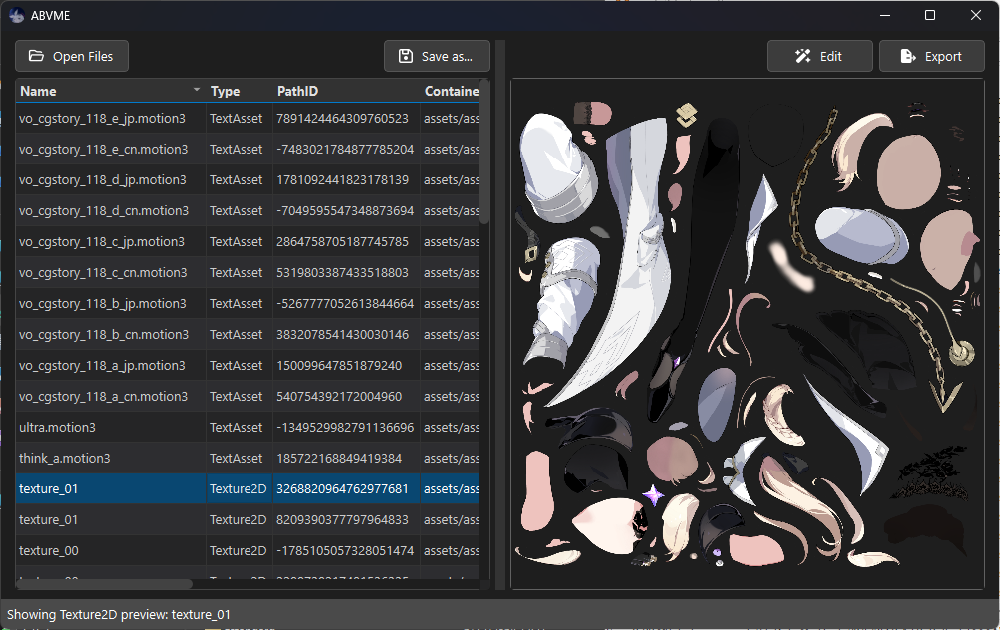

# ABVME
**Asset Bundles Viewer Modifier and Exporter**

A simple tool for viewing, modifying, and exporting Unity Asset Bundles.
Easy to use like [AssetStudio](https://github.com/Perfare/AssetStudio), but focused on making asset modification simpler. Built with Python using [UnityPy](https://github.com/K0lb3/UnityPy).

## 📸 Screenshot

<details>
  <summary><b>Click to expand</b></summary>
  
</details>

## Usage
- Pre-built Windows builds from [Releases](https://github.com/com55/ABVME/releases/latest):
  - **Setup** (`ABVME-Windows-x64-Setup.exe`) — per-user install under Local AppData; can update from **About**
  - **Portable** (`ABVME-Windows-x64-Portable.zip`) — unzip and run; updates via the Releases page
- Linux: portable zip from Releases
- Or clone and run from source:
  ```bash
  git clone https://github.com/com55/ABVME.git
  cd ABVME
  ```
  - **Using [uv](https://github.com/astral-sh/uv#installation) (Recommended)**
    ```bash
    uv sync
    uv run main.py
    ```
  - **Using pip**
    ```bash
    pip install -r requirements.txt
    python main.py
    ```

## Features
- **Asset Preview** - View asset contents directly in the app
- **Asset Export** - Export single or multiple selected assets
- **Asset Modification** - Replace asset data with external files
- **Bundle Saving** - Save modified AssetBundles back to disk (all / selected / per-bundle)
- **Save / Options** - Compression (including LZ4HC), resource patch method (Inline / Orphan cleanup / Rebuild .resS), and CRC correction (Off / On / Auto for Windows)
- **Column Filtering** - Filter the asset table by Type and Source File
- **Drag & Drop**
  - Drop files anywhere on the window (table, preview, and empty space all count)
  - AssetBundles (`.bundle`, `.unity3d`, or UnityFS) open; an overlay shows Open vs Replace while dragging
  - Other files replace the selected asset. Texture2D accepts common image types. TextAsset accepts any non-bundle file; if the suffix is not in that object's container, a confirm dialog appears
- **Open from Explorer** - Selecting multiple bundle files and opening them loads everything into one window (launches within ~500ms are merged)
- **Supported asset types**
  - **TextAsset** — view, export, replace
  - **Texture2D** — view, export, replace

## TODO
- [ ] Mesh support
- [x] CRC Corrector - Make CRC32 the same as the original file after modification
- [ ] Bundles Migration - Transfer modifications to new base files
- [ ] Atlas Image Unpacker
- [ ] [SpineSkeletonDataConverter](https://github.com/wang606/SpineSkeletonDataConverter) integration (add-on)
- [ ] [SpineViewer](https://github.com/ww-rm/SpineViewer) to render preview file integration (add-on)
- [ ] [BA-AD](https://github.com/Deathemonic/BA-AD) integration to find and download files when migrating to other platforms where they were not downloaded (add-on)

## Contributing
- Found a bug or have a suggestion? Please [open an issue](https://github.com/com55/ABVME/issues)
- Pull requests are welcome!

## Acknowledgments
- [AssetStudio](https://github.com/Perfare/AssetStudio) - The main inspiration
- [UnityPy](https://github.com/K0lb3/UnityPy) - Core library
- [PhotoViewer](https://stackoverflow.com/questions/35508711/how-to-enable-pan-and-zoom-in-a-qgraphicsview/35514531#35514531) - PhotoViewer implementation reference 

## License
MIT

